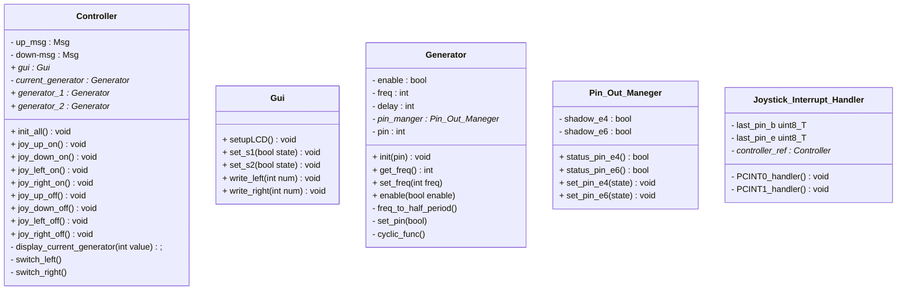

# Labb 4 Realtidssystem
Labb 4 för kursen d0003e realtidssystem.
I uppgiften implementeras en reaktivt system

## GUI klassen
Denna klass tar hand om det grafiska gränsnittet till användaren som att skriva till LCD och sätta segment

## Controller klassen
Syftet för denna kalls ärr att fungera som en controller av de andra klasserna,
den för kallelser av ``Joystick_Interrupt_Handler`` och bestämmer mad som ska göras.
Som exempel är det dens jobb att öka freq, skriva ut den nya freq 
och säkerhetstala att den är på när den får en kalles av ``joy_up_on``.

## Joystick_Interrupt_Handler klassen
Klassen tar hand om när en interrupt sker och skickar vad som hända till Controller klassen med att asynkront kalla på tex ``joy_up_on`` 

## Generator klassen
Denna klass generar en fyrkantig våg på den givna pinnen med den givna frekvensen.

## Pin Out Maneger
Output tass hand av denna klass, detta behövs för att undvika race condition vid skrivning till pinsen.  

## Klass diagram
<!--
hur klass diagramed görs
https://mermaid.js.org/syntax/classDiagram.html
-->

# Implementation

## Gui klassen

### ``setupLCD``
Sätter de register som behövs för att kunna använda LCD

### ``set_s1`` och ``set_s2``
Sätter s1 och s2 segmenten beroende på den inskickade tillstånd

### ``write_left`` och ``write_left``
Skriven det skickade talet till position 0,1 eller 4,5 beroende om det är ``write_left`` eller ``write_right``

## Generator klassen

### ``init``
Sätter upp pin för output och initialselar andra variabler

### ``set_freq``
Sätter ``freq`` och beräknar delay med ``freq_to_half_period``

### ``enable``
Om generatorn kallas med **på** och den är **på** görs ingenting.
Om generatorn kallas med **av** och den är **på** sätts status till av samt pin dras till låg.
Om generatorn kallas med **på** och den är **av** sätts status till på och ``cyclic_func`` kallas.
Om generatorn kallas med **av** och den är **av** görs ingenting.

### ``cyclic_func``
När ``cyclic_func`` kallas och generatorn är av så returnerar functioned.
om generatorn är på så byts stadiet på pin och ``after`` kallas med sig själv med en
tids som beräknades tidigare med ``freq_to_half_period``

## Joystick_Interrupt_Handler klassen

### ``init_joystick``
Funktionen tar och sätter de register för att tillåta interrupts på joystickens pins.
Samt så installeras objektet som en interrupt hanterare på IRQ_PCINT0 och IRQ_PCINT1.
| joystick function | Pin   | interrupt |
| ----------------- | ----- | --------- |
| mitten klick      | PB4   | nr 12     |
| uppåt             | PB6   | nr 14     | 
| nedåt             | PB7   | nr 15     | 
| vänster           | PE2   | nr 2      | 
| höger             | PE3   | nr 3      |

### ``PCINT0_handler`` och ``PCINT1_handler``
Dessa funktioner är kopplade till IRQ_PCINT0 och IRQ_PCINT1
och deras funktion är att kalla ``Controller`` olika metoder som hanterar joystick input
(Tex ``joy_up_on()``).
Separering av objects funktion bryts lite då även fördröjning skickas med för att undvika att utöka ``Controller`` klassens kod för mycket.

## Controller klassen

### ``init_all``
Initialization av delar av programmet sker i denna funktion,
så som att sätta s1 segmentet till på och sätta current_generator variabeln till den första generatorn.
Även 00 skrivs till de båda nummer positionerna.

### ``joy_up_on``, ``joy_up_off``, ``joy_down_on`` och ``joy_down_on``
Dessa funktioner tar hand om att öka och sänka den nuvarande generatorns frekvens, och skicka av eller på signal till generatorn om frekvensen blir 0 respective 1.
När tex ``joy_up_on`` kallas ökas den nuvarande generatorn och des nya värdet skickas till Gui.
Därefter kallas ``joy_up_on`` med dess baseline är nuvarande baseline + invärdet (omhändertaget av AFTER), invärdet som skickas till den nya ``joy_up_on``
är 100ms. när ``Joystick_Interrupt_Handler`` kallar på ``joy_up_on`` så kommer nästa ``joy_up_on`` om 1000ms,
därefter kommer resten av ``joy_up_on`` komma med en avstånd på 75ms.
det existera specialfall då ``enable`` kommer skickas för att stänga av eller på generatorn. 

När off kallas tas den uppkommande ``joy_up_on`` bort med hjälp av ``ABORT``.

### ``joy_left_on`` och ``joy_right_on``
dessa funktioner ändrar current_generator och kallar på gui för att ändra vilket segment som indikerar aktiv generator.

### ``joy_left_off`` och ``joy_right_off``
Gör ingenting men finns för att kunna utöka funktionaliteten vid senare skede

### ``display_current_generator``
Denna hjälpfunktion tittar på vilken current_generator är och väljer om 

