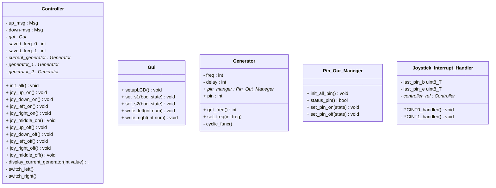

# Labb 4 Realtidssystem
Labb 4 för kursen d0003e realtidssystem.
I uppgiften implementeras ett reaktivt system för att styra två fyrkant vågs generatorer.

## GUI klassen
Denna klass tar hand om det grafiska gränsnittet till användaren som att skriva till LCD och sätta segment

## Controller klassen
Syftet för denna kalls ärr att fungera som en controller av de andra klasserna,
den för kallelser av ``Joystick_Interrupt_Handler`` och bestämmer vad som ska göras.
Som exempel är det dens jobb att öka freq och skriva ut den nya freq när ``joy_up_on`` kallas.

## Joystick_Interrupt_Handler klassen
Klassen tar hand om när en interrupt sker och skickar vad som hända till Controller klassen med att asynkront kalla på tex ``joy_up_on`` 

## Generator klassen
Denna klass generar en fyrkantig våg på den givna pinnen med den givna frekvensen.

## Pin Out Maneger
Output tass hand av denna klass, detta behövs för att undvika race condition vid skrivning till kontroll register för output.  

## Klass diagram
<!--
hur klass diagramed görs
https://mermaid.js.org/syntax/classDiagram.html
-->


# Implementation

## Gui klassen

### ``setupLCD``
Sätter de register som behövs för att kunna använda LCD

### ``set_s1`` och ``set_s2``
Sätter s1 och s2 segmenten beroende på den inskickade tillstånd

### ``write_left`` och ``write_left``
Skriven det skickade talet till position 0,1 eller 4,5 beroende om det är ``write_left`` eller ``write_right``

## Generator klassen

### ``init``
Sätter upp pin för output och initialselar andra variabler

### ``set_freq``
Sätter ``freq``
avbryter nästa ``cyclic func`` om det finns en.
Om freq är 0 så sätts dras pin låg annars beräknas en ny delay och en ny cyclic function startar.

### ``cyclic_func``
När ``cyclic_func`` kallas och generatorn är av så returnerar functioned.
om generatorn är på så byts stadiet på pin och ``after`` kallas med sig själv med en
tids som beräknades tidigare med ``freq_to_half_period``

## Joystick_Interrupt_Handler klassen

### ``init_joystick``
Funktionen tar och sätter de register för att tillåta interrupts på joystickens pins.
Samt så installeras objektet som en interrupt hanterare på IRQ_PCINT0 och IRQ_PCINT1.
| joystick function | Pin   | interrupt |
| ----------------- | ----- | --------- |
| mitten klick      | PB4   | nr 12     |
| uppåt             | PB6   | nr 14     | 
| nedåt             | PB7   | nr 15     | 
| vänster           | PE2   | nr 2      | 
| höger             | PE3   | nr 3      |

### ``PCINT0_handler`` och ``PCINT1_handler``
Dessa funktioner är kopplade till IRQ_PCINT0 och IRQ_PCINT1
och deras funktion är att kalla ``Controller`` olika metoder som hanterar joystick input
(Tex ``joy_up_on()``).
Separering av objects funktion bryts lite då även fördröjning skickas med för att undvika att utöka ``Controller`` klassens kod för mycket.

## Controller klassen

### ``init_all``
Initialization av delar av programmet sker i denna funktion,
så som att sätta s1 segmentet till på och sätta current_generator variabeln till den första generatorn.
Även 00 skrivs till de båda nummer positionerna.

### ``joy_up_on``, ``joy_up_off``, ``joy_down_on`` och ``joy_down_on``
Dessa funktioner tar hand om att öka och sänka den nuvarande generatorns frekvens.
När tex ``joy_up_on`` kallas ökas den nuvarande generatorn och des nya värdet skickas till Gui.
Därefter kallas ``joy_up_on`` med dess nya baseline är nuvarande baseline + invärdet (omhändertaget av AFTER),
invärdet som skickas till den nya ``joy_up_on`` är 75ms.
När ``Joystick_Interrupt_Handler`` kallar på ``joy_up_on`` så kommer nästa ``joy_up_on`` om 1000ms,
därefter kommer resten av ``joy_up_on`` komma med en avstånd på 75ms.

När off kallas tas den uppkommande ``joy_up_on`` bort med hjälp av ``ABORT``.

### ``joy_left_on`` och ``joy_right_on``
Dessa funktioner ändrar current_generator och kallar på gui för att ändra vilket segment som indikerar aktiv generator.

### ``joy_middle_on``
Funktionen sparar det nuvarande värdet om det inte är ``0``, om det är ``0`` så laddar den in det sparade värdet.
Efter att den har sparrat sätter den det aktiva värdet till ``0``. värdena sparas i ``saved_freq_0`` och ``saved_freq_1``

### ``joy_left_off``, ``joy_right_off`` och ``joy_middle_off``
Gör ingenting men finns för att kunna utöka funktionaliteten vid senare skede

### ``display_current_generator``
Denna hjälpfunktion jämför current generator med gen0 och gen1,
därefter skriver den ut det värde som skickades in.

## ``Pin_Out_Maneger```

### ``init_all_pin``
sätter ``PE4`` och ``PE6`` till output

### ``status_pin``
Returnerar om den inskickade pinnen är hög eller låg. Ett värde av 0 ger PE0, och 1 ger PE1 osv.

### ``set_pin_on`` och ``set_pin_off``
Sätter den givna pinnen hög eller låg, beroende på viket anrop som skickas. tex ``SYNC(pm,set_pin_on, 4)`` skulle sätta PE4 till hög.
