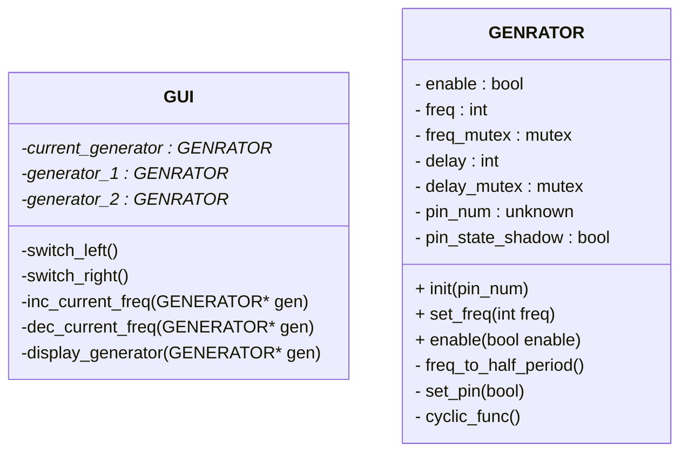

# Labb 4 Realtidssystem
Labb 4 för kursen d0003e realtidssystem.
I uppgiften implementeras en reaktivt system

## Kända problem
Det kan förekomma drift i implementationen då ``After`` har en base då den kallades och inte från föra, så perioden blir längre än avsätt

## GUI klassen
Denna klass tar hand om det grafiska gränsnittet till användaren.
Klassen tar även hand om interrupt som skapas av joysticken.
Klassen kallar på `set_freq()` och `enable()` på klasserna `square_gen`

## Square gen klassen
Denna klass generar en fyrkantig våg på den givna pinnen med den givna frekvensen.

## Klass diagram
<!--
hur klass diagramed görs
https://mermaid.js.org/syntax/classDiagram.html
-->

# Implementation

## GUI klassen

### ``switch_left()`` och ``switch_right()``
Dessa funktioner byter vad ``current_generator`` pekar på,
och byter vilket segment som visar nuvarande generator

### ``inc_current_freq`` och ``dec_current_freq``
Dessa funktioner ökar och minskar ``current_generator`` frekvens.
om frekvensen blir 0 så stängs generator av

### ``display_generator``
Skriver utt frekvensen för ``current_generator`` till LCD

## GENERATOR klassen

### ``init``
Sätter upp pin för output och initialselar andra variabler

### ``set_freq``
Sätter ``freq`` och beräknar delay med ``freq_to_half_period``

### ``enable``
Om generatorn kallas med **på** och den är **på** görs ingenting.
Om generatorn kallas med **av** och den är **på** sätts status till av samt pin dras till låg.
Om generatorn kallas med **på** och den är **av** sätts status till på och ``cyclic_funk`` kallas.
Om generatorn kallas med **av** och den är **av** görs ingenting.

### ``cyclic_func``
När ``cyclic_func`` kallas och generatorn är av så returnerar functioned.
om generatorn är på så byts stadiet på pin och ``after`` kallas med sig själv med en
tids som beräknades tidigare med ``freq_to_half_period``
